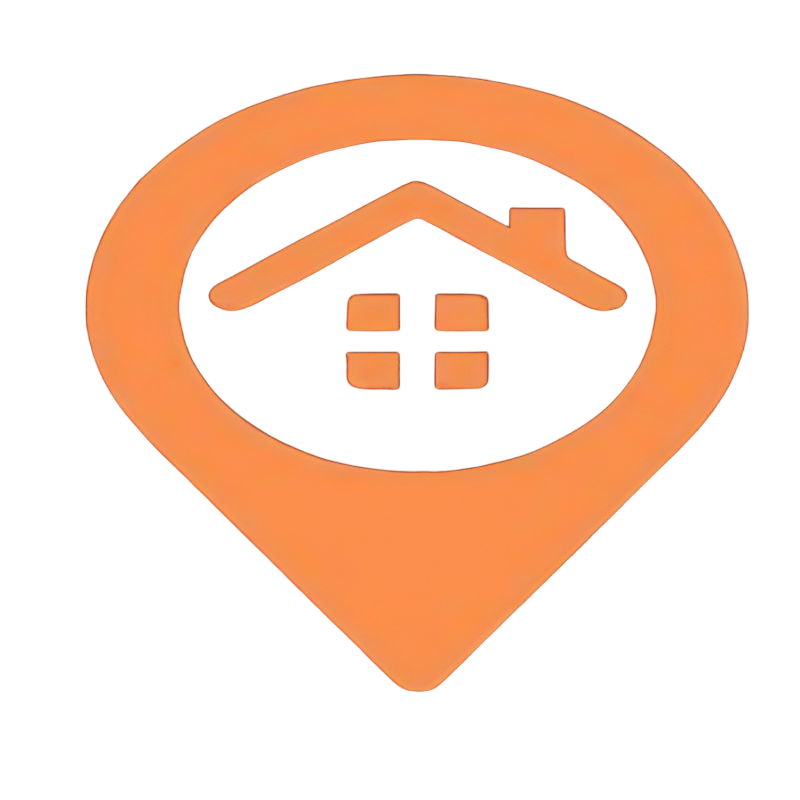

<div align="center">



**Simplifying Rent Payments · Bridging Tenants & Landlords**

[](https://somu3103.github.io/Doorpay/)
[](https://github.com/SOMU3103)
[](https://www.linkedin.com/in/somnath312006)


</div>

---

<div align="center">

### 🔑 &nbsp; *"Discover comfort and joy at home"* &nbsp; 🏠

</div>

---

## ◈ Overview

**DoorPay** is a full-stack web platform that revolutionizes the rental experience by connecting **tenants** and **landlords** through a single, seamless platform. Beyond just rent — DoorPay handles lease agreements, water services, transport during relocation, and round-the-clock support.

> A groundbreaking solution that bridges the gap between tenants and landlords through innovative communication and transparent processes.

**100+ Tenants · 100+ Homeowners · 24/7 Support · Zero Hassle**

---
---

## ◈ Pages & Navigation

```
DoorPay Website
│
├── 🏠  Home        →  Hero section, features, booking form
├── ℹ️  About       →  Platform story, mission, stats
├── 🏘️  Rent        →  Browse available rental properties
└── 📞  Contact     →  Get in touch with the team
```

---

## ◈ Services

| # | Service | Description |
|---|---------|-------------|
| 📄 | **Lease Agreement** | Access and sign customizable, legally vetted agreements instantly |
| 💧 | **Water Service** | Arrange regular water deliveries directly to your doorstep |
| 🚚 | **Transport & Relocation** | Furniture arrangements and luggage management for smooth moves |
| 🕐 | **24/7 Support** | Instant access to maintenance requests, emergencies & rental inquiries |

---

## ◈ Target Customers

```
┌──────────────────────────────────────────────────────────┐
│                                                          │
│  👤 Tenants              Seamless payments, services,    │
│                          real-time updates               │
│                                                          │
│  🏠 Landlords            Efficient rent collection &     │
│                          property management             │
│                                                          │
│  🏢 Property Companies   Integrated multi-property       │
│                          management solutions            │
│                                                          │
│  🤝 Real Estate Agents   Automated systems & tools       │
│                          for property management         │
│                                                          │
└──────────────────────────────────────────────────────────┘
```

---

## ◈ Tech Stack

```yaml
Frontend  : HTML5, CSS3, JavaScript 
Framework : Bootstrap 5
Production : Django 
Animations: WOW.js, Animate.css, Owl Carousel
Icons     : Font Awesome, Bootstrap Icons
Fonts     : Google Fonts (Heebo, Nunito, Pacifico)
Hosting   : GitHub Pages

```

---

## ◈ Project Structure

```
Doorpay/
│
├── 📄 index.html          # Home page
├── 📄 about.html          # About DoorPay
├── 📄 rent.html           # Rental listings
├── 📄 contact.html        # Contact form
│
├── 📂 css/
│   ├── bootstrap.min.css  # Bootstrap framework
│   └── style.css          # Custom styles
│
├── 📂 js/
│   └── main.js            # App logic
│
├── 📂 img/                # Images & icons
│   ├── hero1.png
│   ├── icon1.png
│   └── ...
│
└── 📂 lib/                # Third-party libraries
    ├── animate/
    ├── owlcarousel/
    └── wow/
```

---

## ◈ Getting Started

**1. Clone the repository**
```bash
git clone https://github.com/SOMU3103/Doorpay.git
cd Doorpay
```

**2. Open in browser**
```bash
# Simply open index.html in any browser
# OR use Live Server in VS Code for best experience
```

**3. Deploy**
```bash
# Already live at:
# https://somu3103.github.io/Doorpay/
```

> No installations. No dependencies. Pure HTML/CSS/JS — open and run.

---

## ◈ Operational Plan

- ✅ Automate rent payments and generate instant receipts
- ✅ Simplify communication between tenants and landlords
- ✅ Provide add-on services: water, food, and transport
- ✅ Real-time notifications for both parties
- ✅ Ensure all transactions are recorded and accessible

---

## ◈ Challenges & Solutions

| Challenge | Solution |
|-----------|----------|
| 📈 Changing consumer demands | Continuous feature updates based on user feedback |
| 🔒 Consumer perception of risk | Transparent processes and secure transactions |
| 👷 Shortage of skilled personnel | Targeted hiring and team upskilling |

---

---

## ◈ Contributing

```bash
git clone https://github.com/SOMU3103/Doorpay.git
git checkout -b feature/your-feature
git commit -m "feat: your improvement"
git push origin feature/your-feature
# → Open a Pull Request
```

**Ideas welcome:**
- 🗺️ Map-based property search
- 💳 Online rent payment gateway
- 📱 Progressive Web App (PWA) support
- 🔔 Push notifications for tenants
- 📊 Landlord analytics dashboard

---

## ◈ License

```
MIT License — Copyright (c) 2026 SOMNATH (SOMU3103)
Designed & Distributed under MIT
```

---

<div align="center">

**© 2026 DoorPay · All Rights Reserved by SOMNATH**

[](https://somu3103.github.io/Doorpay/)
[](https://www.linkedin.com/in/somnath312006)
[](https://github.com/SOMU3103)

*⭐ Star this repo if DoorPay inspired you!*

`🔑 — Finding home should be joyful, not stressful. DoorPay makes it so. — 🏠`

</div>
